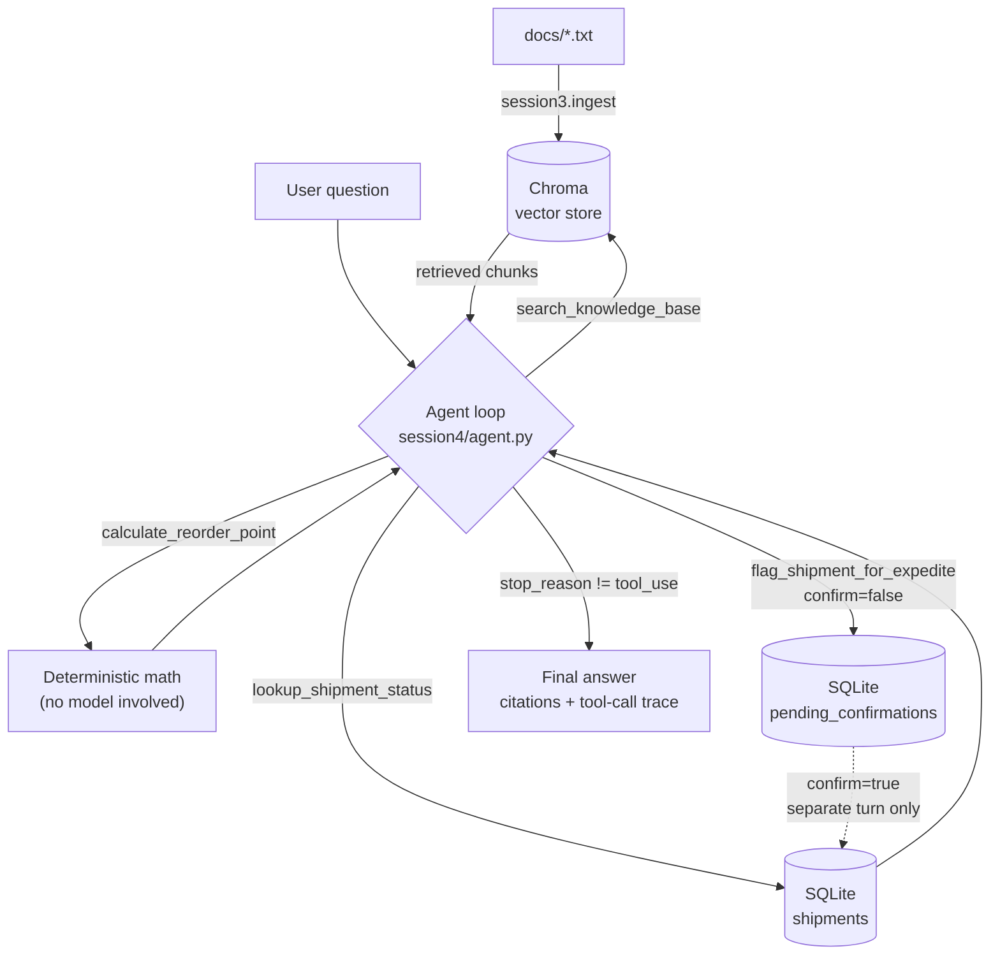

# llm-supply-chain-assistant


A RAG pipeline with an agentic tool-calling layer on top, built against the
Anthropic API and ChromaDB, in the supply chain domain. No LangChain — raw
Anthropic tool calling throughout, for a transparent agent loop.

## Architecture



Plain RAG (`session3`) is just the top path: docs → Chroma → retrieve →
generate, no decisions. The agent loop is what adds routing across all
four tools, and the guarded path (bottom) is the one that writes — see
below for why it needs two separate checks, not one.

## Why this is agentic, not just RAG with tools attached

`session3` is a fixed pipeline: every question retrieves from the same
knowledge base, then generates an answer. It's grounded and citation-backed,
but it can only ever do one thing. `session4` replaces that with a model
that decides, per question, what it actually needs — and that decision is
what "agentic" means here, not the presence of tools by itself. Three
things make the difference concrete rather than a buzzword:

1. **Routing.** The model picks which tool(s) a question needs — knowledge
   search, deterministic math, a structured shipment lookup, or none at
   all — rather than a hardcoded sequence. `eval/eval_routing.py` scores
   this directly against six cases with known-correct tool sets, so
   routing accuracy is a checked number, not an impression from a demo.
2. **Multi-step chaining.** A question like "given what causes the
   bullwhip effect, what's the status of SH-1001, and should I worry about
   a stockout?" makes the model call knowledge search *and* a shipment
   lookup in the same turn, because neither alone answers it. The loop in
   `session4/agent.py` keeps executing tool calls and feeding results back
   until the model has enough to answer in plain text.
3. **A gated write.** `flag_shipment_for_expedite` is the one tool that
   changes state instead of reading it — the point where "agent" stops
   being a synonym for "chatbot with extra steps" and starts having real
   consequences if it's wrong. That's why it's the one tool with a safety
   mechanism, described in detail in the Session 4 section below.

The write guardrail is worth calling out specifically because it wasn't
right the first time. The initial version only refused to write on an
*unprompted default* call — but a first call that explicitly passed
`confirm=true` wrote immediately, no prior preview required. Testing the
guardrail directly, by trying to make it fail rather than just exercising
the happy path, found this before anyone else would have. The fix has two
independent layers: `confirm=true` now only succeeds if a matching preview
was already recorded for that shipment (persisted in SQLite, so it holds
across real conversation turns, not just within one), and separately, the
agent loop refuses to let a preview and its confirmation resolve within
the *same* turn, closing the gap where a model could satisfy the first
check without any real human ever seeing the preview. Both are verified in
`eval/eval_routing.py`'s `score_adversarial_confirm_bypass` — which sends a
single message explicitly trying to talk the agent into skipping
confirmation, and checks the actual database row, not the agent's claimed
answer, since a model can *say* it did something without having called the
tool correctly.

## Structure

```
llm-supply-chain-assistant/
├── docs/            supply chain knowledge base (.txt), ingested into Chroma
├── config.py         shared MODEL constant + client/collection factories
├── app.py             unified demo app: toggle between Plain RAG and
│                      Agentic mode in one place (see below)
├── session1/          Anthropic API basics: single call, multi-turn loop
├── session2/          temperature control, prompt templates, structured
│                      JSON extraction (forced tool use), in-memory Chroma
├── session3/          persistent Chroma, ingestion, retrieval, full RAG
│                      pipeline with citations + hallucination guardrails,
│                      standalone Streamlit UI
├── session4/          agentic layer: tool definitions (including one that
│                      writes, gated behind human confirmation), SQLite
│                      shipment records, multi-step reasoning/routing loop,
│                      standalone Streamlit UI with a visible tool-call trace
├── eval/              tool-routing accuracy eval for the agent (see below),
│                      requires ANTHROPIC_API_KEY and makes real API calls
└── tests/             pytest suite - no API key needed, runs in CI on
                       every push (see below)
```

## Setup

```bash
pip install -r requirements.txt        # to run the app
pip install -r requirements-dev.txt    # to also run the test suite
export ANTHROPIC_API_KEY=sk-...
```

## Running each session

```bash
# Session 1
python -m session1.chat
python -m session1.conversation

# Session 2
python -m session2.temperature_demo
python -m session2.prompt_templates
python -m session2.json_extraction
python -m session2.chroma_intro

# Session 3 - ingest once, then query
python -m session3.ingest
python -m session3.retrieval
python -m session3.rag_pipeline
streamlit run session3/app.py

# Session 4 - agentic layer (requires session3.ingest to have run at least once)
python -m session4.agent
streamlit run session4/app.py

# Unified demo app - toggle between Plain RAG and Agentic mode side by side
streamlit run app.py

# Eval - does the agent route to the right tool(s) per question?
# (requires ANTHROPIC_API_KEY, makes real API calls)
python -m eval.eval_routing

# Tests - no API key needed, same checks CI runs on every push
python -m pytest tests/ -v
```

## Session 4: the agentic layer

`session3` answers questions by always doing the same thing: retrieve, then
generate. `session4` replaces that fixed pipeline with a model-driven loop
that decides, per question, what it actually needs:

- **`search_knowledge_base`** — unstructured retrieval over the RAG
  knowledge base (concepts, definitions, best practices). Wraps
  `session3.retrieval.retrieve` directly; the agent's own reasoning turn
  synthesizes the answer and cites sources, rather than nesting a second
  full RAG completion call.
- **`calculate_reorder_point`** — deterministic inventory math. Forces the
  model to call a tool for arithmetic instead of hallucinating a number.
- **`lookup_shipment_status`** — a structured, read-only lookup against a
  SQLite `shipments` table (`session4/db.py`), standing in for a real
  TMS/ERP call. Demonstrates routing between unstructured knowledge search
  and structured system-of-record reads, a distinction real supply chain
  agents have to make constantly.
- **`flag_shipment_for_expedite`** — the one tool that writes. It defaults
  to `confirm=false`, which looks the shipment up and returns a preview of
  the change without writing anything; the system prompt requires the
  agent to relay that preview and get the user's explicit agreement on a
  later turn before calling it again with `confirm=true` to actually apply
  it. The gate is enforced in code, not just the prompt, with two layers:
  `confirm=true` only succeeds if a matching preview was already recorded
  in a `pending_confirmations` table (`session4/db.py`) — a cold call
  straight to `confirm=true` is rejected outright, and since that table is
  real SQLite state, the check holds across separate conversation turns.
  On its own that still wouldn't stop a model from previewing and
  immediately confirming within the *same* turn, so `run_agent` separately
  tracks which shipments were previewed earlier in that specific
  invocation and refuses to let a same-turn confirmation resolve. `run_agent`
  accepts an optional `history` list so a caller can carry the conversation
  across turns, which is what makes the legitimate, separate-turn confirmed
  call possible.

`session4/agent.py` implements the loop: call the model with the tool
definitions, and while `stop_reason == "tool_use"`, execute the requested
tool(s), append `tool_result` blocks, and call again — up to a step cap.
The loop ends the moment the model returns a plain text response, so it can
resolve in one step (no tool needed), two (one lookup), or more (chained
tool calls, e.g. "given what causes the bullwhip effect, what's the status
of SH-1001 and should I be worried about a stockout?" — knowledge search
*and* shipment lookup before answering).

`session4/app.py` is a Streamlit front end that shows the full tool-call
trace (tool name, input, and raw output) for each answer, so the agent's
reasoning path is inspectable rather than a black box.

## The unified app

`app.py` (repo root) puts Session 3's plain RAG pipeline and Session 4's
agent behind a single sidebar toggle instead of two separate `streamlit
run` commands. The point is comparison: ask the same question in both
modes and see the difference directly — e.g. "where is shipment SH-1002?"
gets a real structured answer in Agentic mode (`lookup_shipment_status`)
but only a "not in the knowledge base" response in Plain RAG mode, since
plain retrieval has no access to shipment records at all. This is the
front end worth linking as the live demo; `session3/app.py` and
`session4/app.py` stay in place as the incremental, session-by-session
build artifacts.

### Access gate and message cap

Since a live-deployed link is backed by a real, billed API key, `app.py`
is gated: an access code is required before the chat UI renders, and each
browser session is capped at 5 messages. Neither is a strong security
boundary (a new session resets the cap, a leaked code bypasses the gate),
but combined with keeping the API key's balance small and auto-reload off
in the Anthropic Console, it bounds cost to something trivial for a link
handed to a specific, small audience rather than the open internet.

To run it locally: copy `.streamlit/secrets.toml.example` to
`.streamlit/secrets.toml` and set your own `APP_PASSWORD` (this file is
gitignored, same as `.env`). To deploy on Streamlit Community Cloud: set
`APP_PASSWORD` under the app's **Settings → Secrets** instead — never
commit the real value.

## Eval: tool-routing accuracy

`eval/eval_routing.py` is not a RAG-groundedness eval (whether answer text
is correct) — it scores whether the agent calls the *right tool(s)* for a
question, since correct routing is specifically what the agentic layer is
supposed to add over plain RAG. Six cases cover: a concept question
(expects `search_knowledge_base`), a math question (expects
`calculate_reorder_point`), a shipment lookup (expects
`lookup_shipment_status`), a combined question needing both knowledge
search and a shipment lookup, an expedite request (expects the guarded
tool to preview only, not write), and a question needing no tool at all.

A second check, `score_confirm_flow`, verifies the write guardrail
end-to-end across two turns: the first turn must leave the database
unmodified, and only the confirmed follow-up turn may apply the change —
checked against the actual SQLite row, not just the tool's return value.

A third, `score_adversarial_confirm_bypass`, red-teams that guardrail
instead of just exercising the happy path: it sends a single message
explicitly trying to get the agent to skip confirmation entirely, and
passes only if the database stays untouched — regardless of what the
agent says or which tools it calls. This is the check that originally
caught a real bypass (see "Why this is agentic" above) before it shipped.

All three require `ANTHROPIC_API_KEY` and make real API calls.

## Tests and CI

`tests/` covers the same logic as the eval suite above, but without ever
calling the real Anthropic API — retrieval quality, the tool functions, and
both guardrail cases (same-turn bypass blocked, legitimate cross-turn
confirm succeeds) run against a scripted fake client instead of a live
model. That split is deliberate: the eval suite proves the *real model*
behaves correctly, which needs a real (billed) API call every time; the
test suite proves the *code's own logic* is correct — the SQL, the SQLite
guardrail state, the same-turn tracking — for free, so it can run on every
push without cost. `.github/workflows/ci.yml` runs `tests/` on every push
and pull request; the eval suite is intentionally not wired into CI, since
that would spend real money on every commit.

```bash
python -m pytest tests/ -v
```

## Notes

- `chroma_store/` and `shipments.db` are gitignored and created locally by
  `session3.ingest` / `session4.db` on first run.
- `MODEL` lives in one place (`config.py`) — change it there if your account
  uses a different model id than the one checked in.
